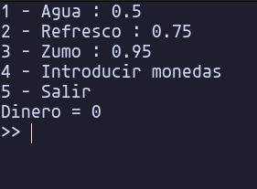
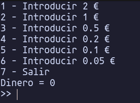

# Máquina expendedora

Se trata de un programa en **Python** que funciona como una máquina expendedora.

Cuenta con una función con el *menú principal*, otra función para *introducir monedas*, y una última función para *devolver las monedas* necesarias.

Las monedas que admite el programa son de **2€, 1€, 0.50€, 0.20€, 0.10€ y 0.05€**.

## Galería

## Controles

Para moverte entre los menús verás un número a la izquierda de cada opción. Introduce el número de la opción que quieres después de las dos flechas
`>> `